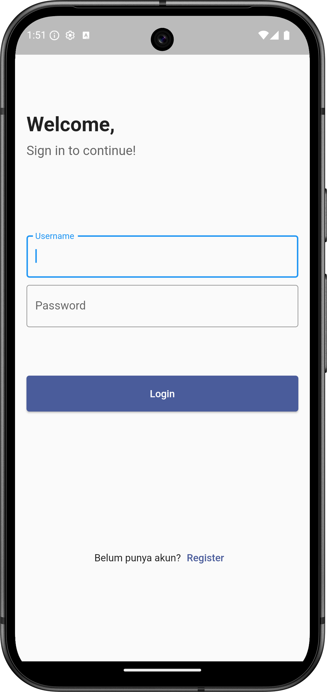
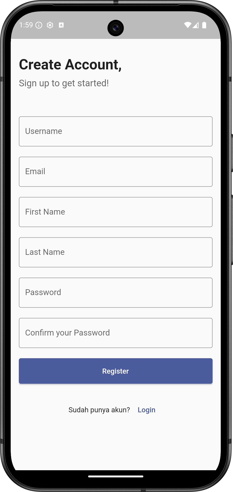
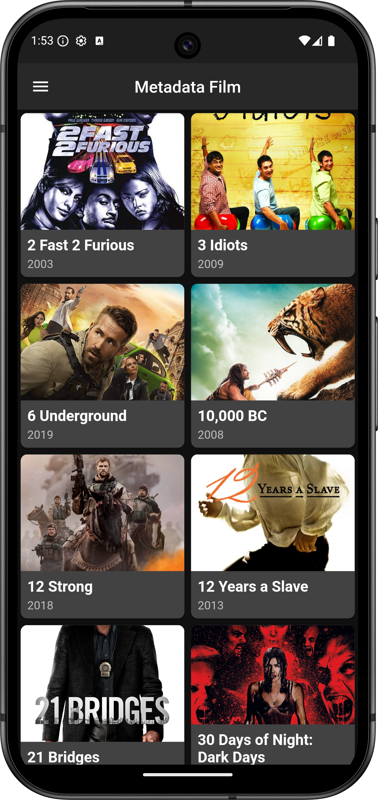
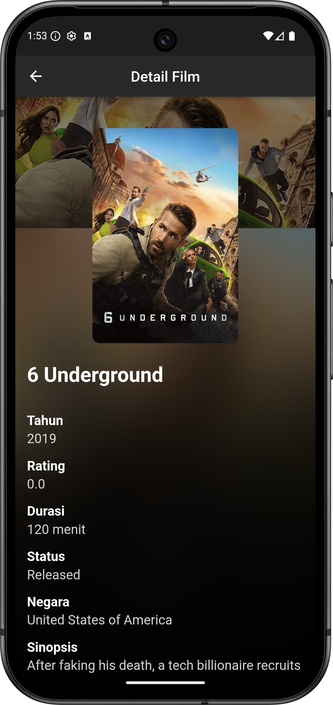
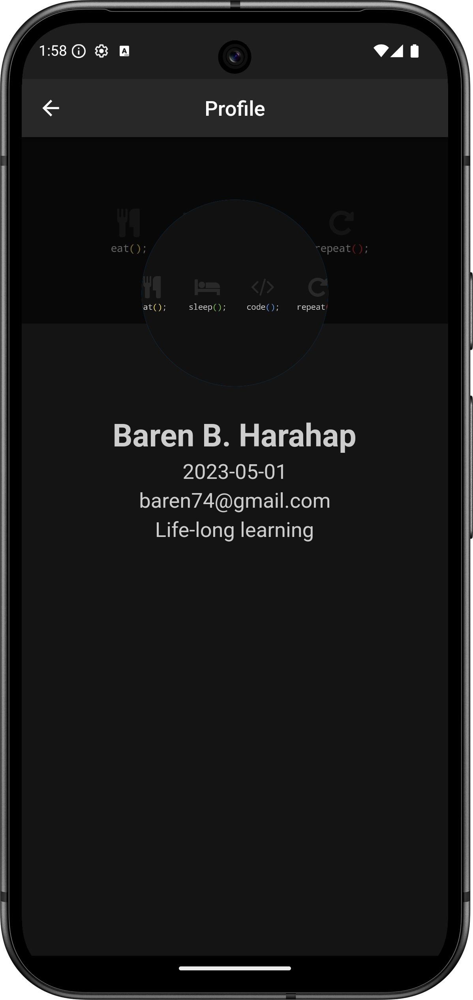
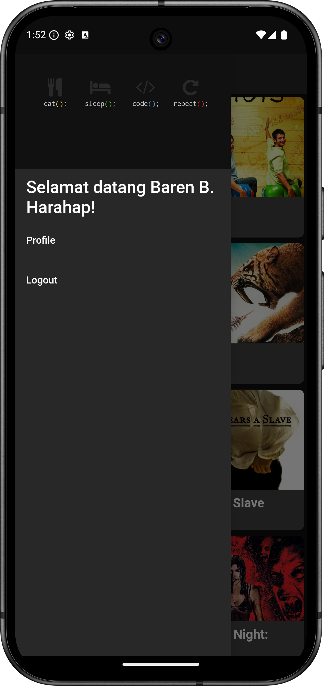
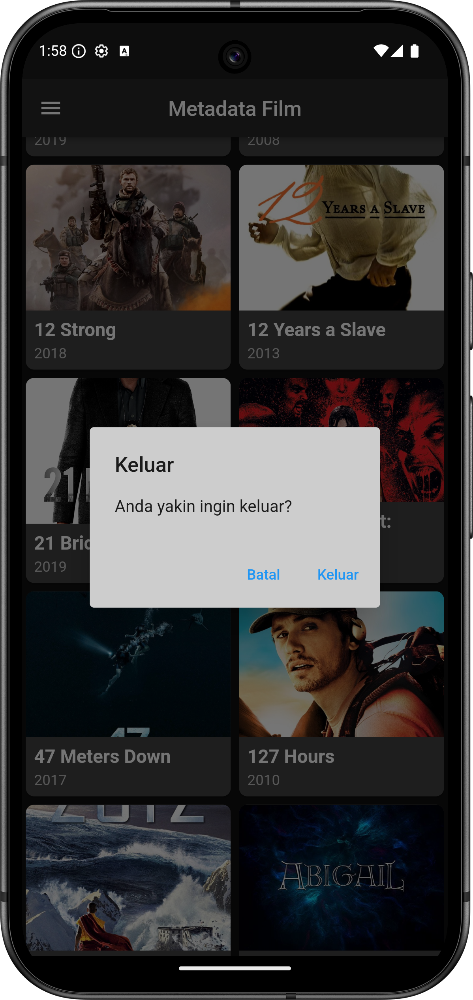

# Flutter Movie Metadata App

A comprehensive Flutter mobile application that serves as a front-end interface for a movie metadata database powered by Django REST API. This application allows users to browse film information, view detailed metadata, manage user accounts, and personalize their movie viewing experience.

## 📱 Features

### User Management
- **Authentication**
  - Secure login with username and password
  - New account registration with validation
  - Session persistence using Hive storage
  - Profile viewing and management

### Movie Browsing
- **Film Gallery**
  - Grid-based film display with thumbnails
  - Year and title information at a glance
  - Responsive layout for various screen sizes

### Film Details
- **Comprehensive Metadata**
  - Title, year, and rating information
  - Duration and status indicators
  - Country of origin
  - Synopsis/description
  - Languages supported
  - Film genres
  - Directors and actors

### UI/UX
- **Modern Design**
  - Glassmorphism effects for detail views
  - Dark theme implementation
  - Custom color palette
  - Responsive layouts
  - Avatar and profile images

## 🛠️ Architecture

The application follows a clean architecture pattern with clear separation of concerns:

### Frontend (Flutter)
- **State Management**: BLoC pattern for reactive and testable code
- **API Communication**: Dio HTTP client
- **Local Storage**: Hive for persistent session management
- **UI Components**: Custom widgets with Material Design

### Backend (Django)
- **REST API**: Django REST Framework endpoints
- **Authentication**: Token-based auth system
- **Database**: PostgreSQL/MySQL (configurable)
- **Repository**: [django-RESTful-API-movie-metadata](https://github.com/barenbaruna/django-RESTful-API-movie-metadata)

## 📂 Project Structure

```
lib/
├── bloc/                  # Business Logic Components
│   ├── film/              # Film-related state management
│   └── user/              # User authentication state management
├── core/                  # Core functionality
│   ├── bloc/              # App-wide settings and state
│   ├── api_client.dart    # API configuration and setup
│   └── session_manager.dart # User session handling
├── models/                # Data models
│   ├── film_model.dart    # Film data structure
│   └── login_user_model.dart # User data structure
├── params/                # API request parameters
├── repo/                  # Data repositories
│   ├── auth_repository.dart # Authentication repository
│   ├── film_assets.dart   # Asset path management
│   └── film_repository.dart # Film data repository
├── response/              # API response models
├── ui/                    # User interface components
│   ├── custom_colors.dart # App color palette
│   ├── film/              # Film-related screens
│   │   ├── detail_film.dart  # Film detail view
│   │   └── master_film.dart  # Film gallery view
│   └── user/              # User-related screens
│       ├── login/         # Login functionality
│       ├── profile/       # User profile
│       └── register/      # Registration functionality
└── main.dart              # Application entry point
```

## 📸 Screenshots

<div align="center">

### Authentication Screens

<div style="display: flex; justify-content: space-between; margin-bottom: 20px;">
  <div style="width: 48%;">
    
    <p><em>Clean login screen with helpful error messages</em></p>
  </div>
  <div style="width: 48%;">
    
    <p><em>Easy-to-use signup form that guides users through each step</em></p>
  </div>
</div>

### Core Application Screens

<div style="display: flex; justify-content: space-between; margin-bottom: 20px;">
  <div style="width: 48%;">
    
    <p><em>Well-organized movie gallery showing film covers and titles</em></p>
  </div>
  <div style="width: 48%;">
    
    <p><em>Detailed movie information with a modern, stylish background</em></p>
  </div>
</div>

### User Experience

<div style="display: flex; justify-content: space-between; margin-bottom: 20px;">
  <div style="width: 48%;">
    
    <p><em>User profile page showing personal information in a clean layout</em></p>
  </div>
  <div style="width: 48%;">
    
    <p><em>Side menu giving easy access to all app features</em></p>
  </div>
</div>

### System Interactions

<div style="display: flex; justify-content: center; margin-bottom: 20px;">
  <div style="width: 300px; margin: 0 auto;">
    
    <p><em>Safety confirmation dialog when exiting the application</em></p>
  </div>
</div>

</div>

<blockquote>
These screenshots show how the app is designed to be attractive, easy to use, and consistent across all screens.
</blockquote>

## 🚀 Getting Started

### Prerequisites
- Flutter SDK (latest stable version)
- Dart SDK
- Android Studio / VS Code with Flutter extensions
- An emulator or physical device for testing
- Access to the Django backend API (running separately)

### Installation

1. Clone the repositories:
   ```bash
   # Clone the Flutter frontend
   git clone https://github.com/barenbaruna/flutter_movie.git
   cd flutter_movie
   
   # Clone the Django backend
   git clone https://github.com/barenbaruna/django-RESTful-API-movie-metadata.git
   ```

2. Install dependencies:
   ```bash
   flutter pub get
   ```

3. Configure the backend API endpoint:
   
   Navigate to `lib/core/api_client.dart` and update the base URL to match your Django backend:
   ```dart
   _dio.options.baseUrl = 'http://your-backend-server:8000/api/';
   ```
   
   > Note: The default URL is set to `http://10.0.2.2:8000/api/` which points to localhost on Android emulators

4. Run the application:
   ```bash
   flutter run
   ```

## 🌐 API Integration

The application integrates with the Django backend repository [django-RESTful-API-movie-metadata](https://github.com/barenbaruna/django-RESTful-API-movie-metadata) via the following endpoints:

### Authentication
- `POST /api/v1/register` - Create a new user account
- `POST /api/v1/login` - Authenticate and retrieve session token

### Film Data
- `GET /api/film` - Retrieve all films with metadata

## 📱 Application Flow

1. **Startup**: The app checks for an existing session
2. **Authentication**: Users log in or register if no session exists
3. **Film Browsing**: Authenticated users can browse the film gallery
4. **Film Details**: Tap on a film to view detailed information
5. **Profile**: Users can view and manage their profile
6. **Logout**: End the session and return to login
7. **Exit Confirmation**: A confirmation dialog prevents accidental app closures

## 💾 Session Management

The app uses Hive for local session storage, persisting:
- User ID
- Authentication token
- Profile information (name, email, avatar)
- Session state

## 🎨 UI Components

### Custom Colors
The application uses a consistent color palette defined in `custom_colors.dart`:
- `primary1`: #101010 (Dark background)
- `primary2`: #282828 (Secondary background)
- `secondary1`: #CDCDCD (Light text/elements)
- `accentColor`: #4A5C9B (Accent buttons/highlights)

### Glassmorphism
Film details utilize a glass-like effect for an elegant, modern UI with the `glassmorphism` package.

## 📦 Dependencies

- `flutter_bloc` & `bloc`: State management
- `dio`: API communication
- `hive` & `hive_flutter`: Local storage
- `glassmorphism`: UI effects
- `cached_network_image`: Image caching

## 🔜 Future Enhancements

- Search functionality
- User ratings and reviews
- Favorites/watchlist feature
- Offline mode support
- Enhanced filtering options
- Personalized recommendations

## 👥 Contributing

1. Fork the repository
2. Create your feature branch (`git checkout -b feature/amazing-feature`)
3. Commit your changes (`git commit -m 'Add some amazing feature'`)
4. Push to the branch (`git push origin feature/amazing-feature`)
5. Open a Pull Request

## 📄 License

This project is licensed under the MIT License - see the LICENSE file for details.

## 🙏 Acknowledgements

- Flutter team for the amazing framework
- Django REST Framework for the backend API capabilities
- All the package authors that made this project possible
